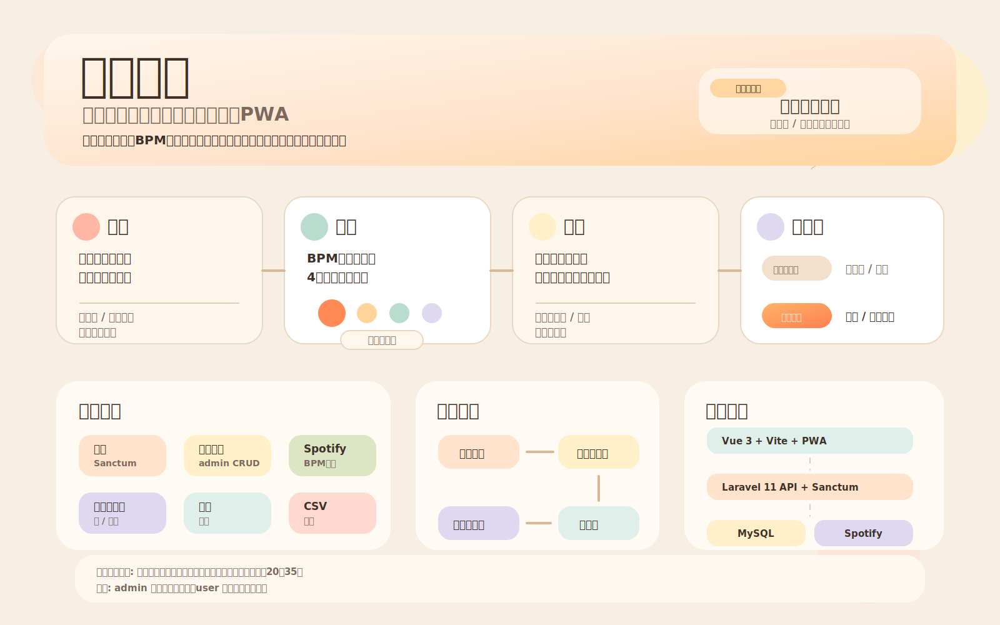

# ウタエル

符割り確認特化型カラオケ支援アプリ

カラオケ直前に**音を出さず**、BPMの視覚フィードバックでリズムを確認できるPWAアプリ。

---

## 企画概要



---

## 概要

| 一般的な音楽アプリ | ウタエル |
| --- | --- |
| 音再生前提 | 無音前提 |
| 練習用 | 本番直前用 |
| 採点志向 | 不安解消志向 |

---

## 技術スタック

| 領域 | 技術 |
| --- | --- |
| バックエンド | PHP 8.2 / Laravel 11 |
| 認証 | Laravel Sanctum |
| 権限管理 | Spatie Laravel Permission |
| CSV出力 | Maatwebsite Laravel Excel |
| 外部API | Spotify Web API（BPM取得） |
| DB | MySQL 8.0 |
| フロントエンド | Vue.js 3 + Vite |
| 状態管理 | Pinia |
| HTTP | Axios |
| ルーティング | Vue Router 4 |
| PWA | vite-plugin-pwa |

---

## セットアップ

### 必要環境

- PHP 8.2+
- Composer
- Node.js 18+
- MySQL 8.0

### バックエンド

```bash
composer install
cp .env.example .env
php artisan key:generate
```

`.env` を編集してDB接続情報・Spotify APIキーを設定する。

```bash
php artisan migrate --seed
php artisan serve
```

### フロントエンド

```bash
cd frontend
npm install
cp .env.example .env
npm run dev
```

---

## 環境変数

### バックエンド（`.env`）

```
DB_DATABASE=utaeru
DB_USERNAME=root
DB_PASSWORD=

SPOTIFY_CLIENT_ID=your_client_id
SPOTIFY_CLIENT_SECRET=your_client_secret
```

### フロントエンド（`.env`）

```
VITE_API_URL=http://localhost:8000/api
```

---

## 画面構成

| 画面 | パス | 権限 |
| --- | --- | --- |
| ログイン | `/login` | 全員 |
| マイリスト | `/` | user |
| 曲検索・追加 | `/songs` | user |
| 曲マスタ管理 | `/admin/songs` | admin |

---

## テストアカウント（Seeder）

| ロール | メール | パスワード |
| --- | --- | --- |
| admin | admin@example.com | password |
| user | user@example.com | password |

---

## iPhoneへのインストール（PWA）

1. Safari でアプリのURLを開く
2. 共有ボタン →「ホーム画面に追加」
3. アプリとして起動できる

---

## ライセンス

MIT
