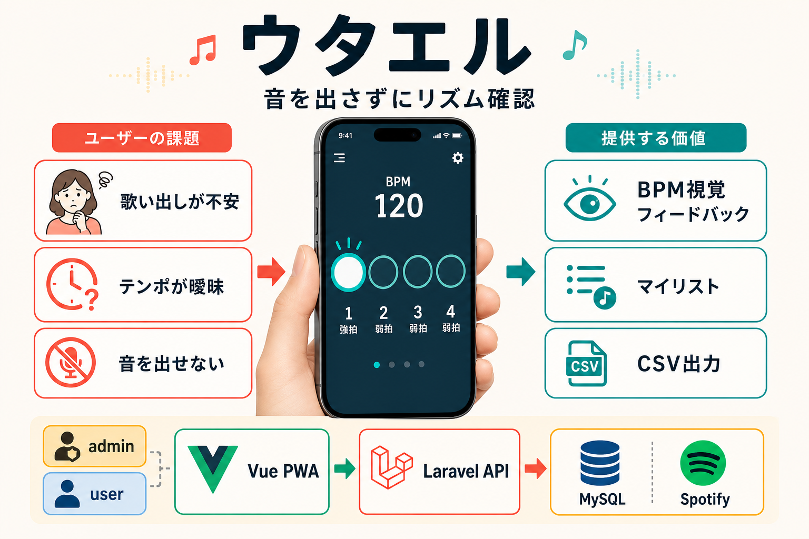

# ウタエル

符割り確認特化型カラオケ支援アプリ

カラオケ直前に**音を出さず**、BPMの視覚フィードバックでリズムを確認できるPWAアプリ。

---

## 振り返りレポート

開発全体の振り返りは、以下にまとめています。

- [ウタエル 開発振り返りレポート](docs/development-review.md)

レポートでは、アプリ概要、全体アーキテクチャ、Issue #1〜#14 の開発プロセス、代表機能の処理フロー、学んだこと、苦戦したこと、今後の改善を確認できます。

---

## 企画概要



---

## 概要

| 一般的な音楽アプリ | ウタエル |
| --- | --- |
| 音再生前提 | 無音前提 |
| 練習用 | 本番直前用 |
| 採点志向 | 不安解消志向 |

---

## 技術スタック

| 領域 | 技術 |
| --- | --- |
| バックエンド | PHP 8.3+ / Laravel 13 |
| 開発環境 | WSL2 / Docker Desktop / Laravel Sail |
| 認証 | Laravel Sanctum |
| 権限管理 | Spatie Laravel Permission |
| CSV出力 | Maatwebsite Laravel Excel |
| 外部サービス | iTunes Search API（曲検索メタデータ）・公式音楽サービスのリンク/埋め込み |
| DB | MySQL 8.4 |
| フロントエンド | Vue.js 3 + Vite |
| 状態管理 | Pinia |
| HTTP | Axios |
| ルーティング | Vue Router 4 |
| PWA | vite-plugin-pwa |

---

## セットアップ

### 必要環境

- WSL2
- Docker Desktop
- Docker Desktop の WSL2 backend
- VS Code + Remote WSL（推奨）

PHP / Composer / MySQL / Node.js は、原則として Laravel Sail のコンテナ内で利用する。
Laravel 13 のため、PHP は 8.3 以上を前提とする。

### 作業場所

このプロジェクトは WSL 内の `~/projects/utaeru` で作業する。
VS Code は Remote WSL で `~/projects/utaeru` を開き、Laravel Sail の操作も WSL 側で実行する。

`/mnt/c`、`/mnt/d`、USBドライブ直下など Windows 側ファイルシステム上で Sail を動かすと、Docker の bind mount でファイルが正しく見えない場合がある。

### バックエンド

Laravel / Sail の初回導入は Issue #1 で実施する。導入後の通常操作は以下。

```bash
./vendor/bin/sail up -d
cp .env.example .env
./vendor/bin/sail artisan key:generate
```

`.env` を編集してDB接続情報を設定する。Spotify連携を有効にする場合だけ、公式SDK用の設定を追加する。

```bash
./vendor/bin/sail artisan migrate --seed
```

### フロントエンド

```bash
./vendor/bin/sail npm install --prefix frontend
cp frontend/.env.example frontend/.env
./vendor/bin/sail npm run dev --prefix frontend
```

---

## 環境変数

### バックエンド（`.env`）

```
DB_DATABASE=utaeru
DB_HOST=mysql
DB_USERNAME=sail
DB_PASSWORD=password

# Spotify連携を使う場合のみ設定
SPOTIFY_CLIENT_ID=your_client_id
SPOTIFY_CLIENT_SECRET=your_client_secret

# Deezer・Spotifyで未取得の場合の任意補助
GETSONGBPM_API_KEY=your_getsongbpm_api_key
```

GetSongBPMを使う場合は、同サービスの利用規約とバックリンク要件を確認してください。未設定でも管理者によるBPM手動入力は利用できます。

### 歌詞API（任意）

歌詞は曲詳細を開いたときにLRCLIB APIから曲名・アーティスト名で取得します。別のAPIを使う場合は、`title` と `artist` のクエリを受け、`lyrics`（歌詞本文）と任意の `source_url`（提供元ページ）をJSONで返すAPIへ差し替えられます。

```dotenv
LYRICS_API_URL=https://lrclib.net/api/get
LYRICS_API_TOKEN=your_token
```

未設定でもLRCLIBを既定取得先として使用します。歌詞が見つからない場合は「歌詞はまだ登録されていません」と表示されます。管理者が登録した歌詞は常に外部APIより優先されます。

### YouTube Data APIキー（`.env`）

YouTube未登録曲のMV候補検索を使う場合だけ設定します。プロジェクト直下の`.env`を開き、次の行の`=`の右側へAPIキーを貼り付けてください。APIキーの値はGitやチャットへ貼り付けないでください。

```dotenv
# YouTube Data API v3（MV候補検索用）
YOUTUBE_API_KEY=ここに取得したAPIキー
YOUTUBE_REGION=JP
YOUTUBE_MAX_RESULTS=10
```

設定後はLaravelの設定キャッシュを更新します。

```bash
./vendor/bin/sail artisan config:clear
```

### フロントエンド（`.env`）

```
VITE_API_URL=http://localhost/api
```

### スマホ実機での確認（Vue PWA）

このプロジェクトはVue 3のPWAであり、React Native用のExpoプロジェクトではありません。Expoへ置き換えず、同じPWAをLAN経由でスマホから確認します。

1. PCとスマホを同じWi-Fiへ接続する。
2. 開発サーバーをLAN公開で起動する。

```bash
./vendor/bin/sail npm --prefix frontend run dev:lan
```

3. WindowsのIPv4アドレス（`ipconfig`の「IPv4 Address」）を確認し、スマホのブラウザで `http://<PCのIPv4>:5173` を開く。
4. ログイン後、必要ならSafari/Chromeの「ホーム画面に追加」でPWAとして確認する。

`VITE_API_URL`が`http://localhost/api`のままでも、LANホストから開いた場合はブラウザ側で同じPCの`/api`へ補正します。接続できない場合はWindowsファイアウォールのTCP 5173/80許可と、Docker Desktopのポート公開を確認してください。

曲詳細のカテゴリ（リズムを確認する・MVを再生する・歌詞を表示する・曲の情報）は、カード自体をつかんで自由に並べ替えられます。順番は同じブラウザの次回表示にも引き継がれます。

---

## 画面構成

| 画面 | パス | 権限 |
| --- | --- | --- |
| ログイン | `/login` | 全員 |
| お気に入り（追加した全曲） | `/` | user |
| 曲検索・追加 | `/songs` | user |
| 曲詳細・再生 | `/songs/:id` | user |
| 曲マスタ管理 | `/admin/songs` | admin |
| プレイリスト | `/playlists` | user |
| 共有プレイリスト | `/shared/playlists/:token` | authenticated user |

---

## テストアカウント（Seeder）

| ロール | メール | パスワード |
| --- | --- | --- |
| admin | admin@example.com | password |
| user | user@example.com | password |

---

## iPhoneへのインストール（PWA）

1. Safari でアプリのURLを開く
2. 共有ボタン →「ホーム画面に追加」
3. アプリとして起動できる

## 動作確認

Playwrightの画面テスト（デスクトップChrome・390×844モバイルエミュレーション）を実行する。

```bash
./vendor/bin/sail npm --prefix frontend run test:e2e
```

起動中のLaravel APIに対するCRUDスモークテストは、検証後に作成データを復元・削除する。

```bash
./vendor/bin/sail npm --prefix frontend run test:live-api
```

接続先・ユーザーを変更する場合は、`E2E_API_URL`、`E2E_SMOKE_EMAIL`、`E2E_SMOKE_PASSWORD`を環境変数で指定する。

---

## ドキュメント

- [ドキュメント一覧](docs/README.md)
- [開発振り返りレポート](docs/development-review.md)
- [要件定義書](docs/01_requirements.md)
- [仕様書](docs/02_specification.md)
- [基本設計書](docs/03_basic_design.md)
- [詳細設計書](docs/04_detail_design.md)
- [プレイリスト・共有・音声再生設計書](docs/05_playlist_share_audio_design.md)
- [ユーザー向け曲検索・カタログ取り込み設計書](docs/06_music_catalog_design.md)
- [お気に入り・プレイリストUX設計書](docs/07_favorites_playlist_ux_design.md)
- [プレイリスト導線・責務整理設計書](docs/08_playlist_navigation_ux_design.md)
- [YouTube公式プレイヤー連携設計書](docs/09_youtube_playback_design.md)

---

## ライセンス

MIT
