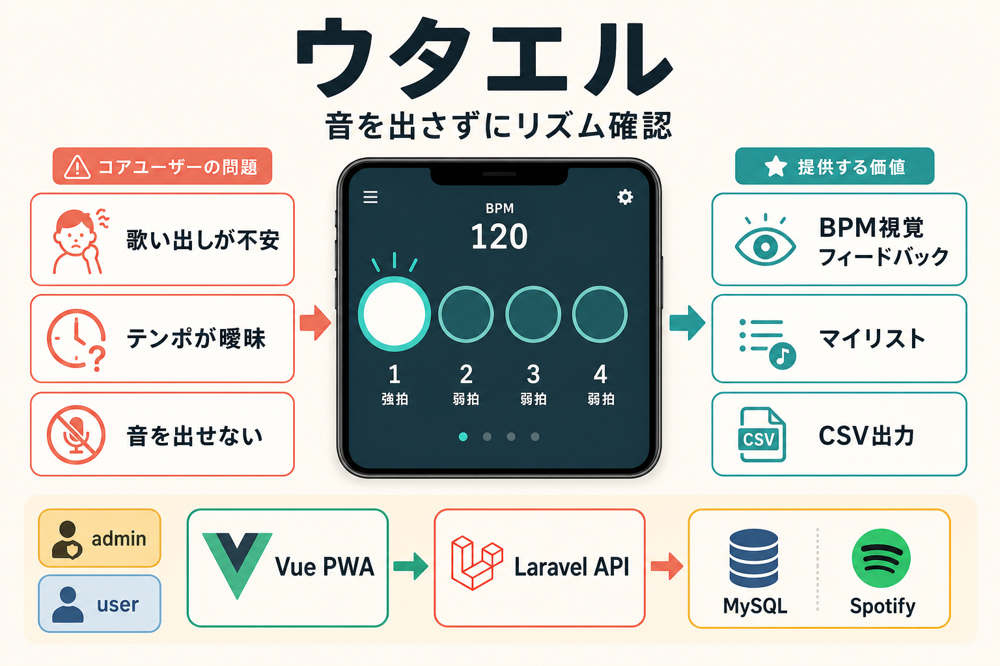

# プロダクト仕様書

**バージョン：** 1.2
**作成・更新日：** 2026年8月
**ステータス：** Issue #34までの現行仕様を反映

---

## 仮称

ウタエル（符割り確認特化型カラオケ支援アプリ）

---

## 1. コンセプト

音を出さずに、リズム（符割り）だけで歌い出しを思い出すアプリ。必要な場合は、曲詳細やプレイリスト詳細からYouTube公式MVを別操作で再生できる。

身体感覚でテンポを再現し、歌い出しの不安を軽減する。



---

## 2. 提供価値

| 課題 | 解決方法 |
| --- | --- |
| テンポが思い出せない | BPM視覚フィードバックで再現 |
| 歌い出しタイミングが曖昧 | 4拍子構造で身体記憶を刺激 |
| 音を出せない | 無音モード（視覚フィードバックのみ）を基本とし、任意で音声再生も可能 |
| 選曲に時間がかかる | マイリスト事前登録機能 |

> ⚠️ iOSはバイブレーションAPIが非対応のため、視覚フィードバック（画面フラッシュ・円の拡縮）でリズムを表現する。

---

## 3. システム構成

### 3.1 技術スタック

| 項目 | 選択 | 理由 |
| --- | --- | --- |
| 開発環境 | WSL2 + Docker + Laravel Sail | 実務に近い再現性の高い環境で学習 |
| バックエンド | Laravel 13（PHP 8.3+） | 案件直結・最新版で学習 |
| 認証 | Laravel Sanctum | SPA・API向け、案件直結 |
| 権限管理 | Spatie Permission | admin/user のロール管理 |
| CSV出力 | Laravel Excel | 業務系で頻出 |
| 外部API | iTunes Search、Deezer BPM、YouTube Data API | 音源ファイルは保存せず、公式YouTubeプレイヤーを利用 |
| DB | MySQL 8.4 | Laravel Sail 標準構成に合わせる |
| フロントエンド | Vue.js 3 + Vite | 案件直結 |
| 状態管理 | Pinia | Vue.js 3標準 |
| HTTP通信 | Axios | Laravel APIとの連携 |
| PWA対応 | vite-plugin-pwa | iOSホーム画面追加 |

### 3.2 ユーザーロール

| ロール | 説明 |
| --- | --- |
| admin | 公開曲マスタ・タグの管理を行う管理者 |
| user | マイリスト・プレイリストを管理し、BPM確認と任意の音声再生を行う一般ユーザー |

---

## 4. 機能構成

### 4.1 コア機能：符割りリズムモード

#### 目的

BPMおよび拍子構造に基づき、視覚フィードバックでリズムを再現する。

#### 入力データ

- 曲名
- BPM（Deezer、設定済みSpotifyの補助取得、または管理者入力。未取得可）
- 拍子（初期は4/4固定）

#### テンポ計算式

```
振動間隔(ms) = 60000 / BPM
例：120BPM → 500ms間隔
```

#### 4拍子視覚パターン

| 拍 | 表示 |
| --- | --- |
| 1拍目 | 大きな円が光る（強拍） |
| 2拍目 | 小さな円が光る（弱拍） |
| 3拍目 | 小さな円が光る（弱拍） |
| 4拍目 | 小さな円が光る（弱拍） |

ループ再生。

#### UI要素

- 曲名表示
- BPM表示
- リズム開始ボタン
- 停止ボタン
- 現在の拍のハイライト表示

---

### 4.2 補助機能：お気に入り（内部名：マイリスト）

#### 目的

「何歌おう問題」の解消と、カラオケ直前の曲選びをスムーズにする。お気に入りは追加したすべての曲を集める個人用ライブラリであり、プレイリストのようなグループ分けは行わない。

#### 機能

| 機能 | 説明 | 権限 |
| --- | --- | --- |
| 公開曲マスタから追加 | adminが登録した曲をお気に入りに追加 | user |
| 検索結果のお気に入り切替 | 登録済み曲はハートを点灯し、再タップでお気に入りから解除 | user（本人のみ） |
| メモ追加・編集 | 歌い出し・注意点などを自由記述 | user（本人のみ） |
| タグ付け | 盛り上がる／しっとり等のタグを付与 | user（本人のみ） |
| 曲削除 | お気に入りから曲を削除 | user（本人のみ） |
| CSVエクスポート | お気に入りをCSVで出力 | user（本人のみ） |

お気に入り一覧では再生せず、曲情報カードをボタンとして押すと曲詳細画面へ遷移する。

> ランダム表示機能はMVPスコープ外（将来対応）

---

### 4.3 管理機能：公開曲マスタ管理

#### 目的

adminが公開曲マスタを管理し、userが利用できる曲を整備する。

#### 機能

| 機能 | 説明 | 権限 |
| --- | --- | --- |
| 曲登録 | 曲名・アーティスト・BPM・任意の公式再生元を登録 | admin |
| 曲編集 | 曲名・アーティスト・権利確認済み歌詞・BPMを編集 | admin |
| 曲削除 | 公開曲マスタから削除 | admin |
| タグ登録 | タグマスタを管理 | admin |

歌詞は外部サイトから自動転載せず、管理者が権利確認済みのテキストを登録する。契約済み歌詞APIを設定した場合だけ補助取得し、曲詳細では歌い出しのプレビュー付き折りたたみカードとして表示する。

既定ではLRCLIBの `GET https://lrclib.net/api/get?track_name={曲名}&artist_name={アーティスト}` を参照し、`plainLyrics`（なければ`syncedLyrics`）を歌詞カードへ表示する。`LYRICS_API_URL`を指定した場合は、`GET LYRICS_API_URL?title={曲名}&artist={アーティスト}` と `{"lyrics":"歌詞本文","source_url":"提供元URL"}` の形式へ差し替えられる。取得に成功した歌詞は曲マスタへ保存し、検索・お気に入り一覧でも同じ歌いだしを再利用する。該当歌詞なしの場合は「未登録」として扱い、API障害でも曲詳細やMV再生は継続できる。

### 4.4 プレイリスト管理・共有

プレイリストはお気に入りの曲を複数グループに整理するためのリストで、1ユーザーが複数作成できる。プレイリスト詳細画面では収録曲を確認し、曲を選択すると曲詳細画面で再生できる。

| 機能 | 説明 | 権限 |
| --- | --- | --- |
| プレイリスト作成 | 名前・説明を入力して作成 | user（本人） |
| 曲追加 | 公開曲マスタから曲を追加 | user（所有者） |
| 曲編集 | プレイリスト内メモ・曲順を編集 | user（所有者） |
| 曲削除 | プレイリストから曲を削除 | user（所有者） |
| プレイリスト編集・削除 | 名前・説明の変更、削除 | user（所有者） |
| 共有 | ランダムトークンの共有URLを発行 | user（所有者） |
| 共有閲覧 | 共有URLから閲覧 | 認証済みuser |
| コピー | 自分のプレイリストへ複製 | 認証済みuser |

共有先はMVPでは読み取り専用とする。元プレイリストの編集権限は所有者だけが持つ。

### 4.5 YouTube MV再生

- 曲詳細ではお気に入りの追加・解除と、既存プレイリストへの曲追加を行える。
- 曲詳細ではBPMリズムプレイヤー・YouTube MV・お気に入り・プレイリスト操作を同じ画面にまとめる。
- 内部の再生キャッシュがあればそれを使い、未登録時だけ内部APIで候補を解決する。ユーザー・管理者が動画IDを入力する画面は用意しない。
- Spotifyの再生UI・公式サービスへの再生リンクは提供しない。
- 音声再生とBPM視覚リズムは別操作であり、同期はMVP対象外とする。
- 音源ファイルのアップロード、抽出、保存、再配信は行わない。

### 4.6 ユーザー向け曲検索

- userは曲名・アーティストでローカル・外部カタログを検索できる。
- 外部検索結果は、お気に入りまたはプレイリストへ追加する時点で曲カタログへ取り込む。
- `provider + provider_key`で重複取り込みを防ぐ。
- BPMが取得できない曲も保存でき、「BPM未登録」と表示する。
- adminは登録の承認者ではなく、重複・不正・誤情報の整理を担当する。

### 4.7 現行の再生・画面遷移ルール

- お気に入り・検索結果では再生を開始せず、曲詳細へ遷移してからリズムやMVを操作する。
- 曲詳細のカテゴリは、リズム、MV、歌詞、曲情報を開閉・並び替えできる。順番はブラウザのlocalStorageに保存する。
- MVはYouTube公式iframeを利用し、曲詳細から離れてもアプリ共通のミニプレーヤーへ移動して再生状態を保持する。
- MV候補にBPMが含まれる場合はそのBPMを優先し、なければ曲マスタのBPMを使ってリズム確認を開始する。個人BPMは通常のリズム確認で曲マスタBPMより優先する。
- 画面遷移はスライドアニメーションで行い、ログイン以外の主要Viewは`KeepAlive`で状態を保持する。

---

## 5. MVP定義

基礎MVP（Issue #1〜#14）：

1. ユーザー認証（登録・ログイン・ログアウト）
2. 公開曲マスタのCRUD（adminのみ）
3. 管理者が公開曲とBPMを登録
4. お気に入り（内部名：マイリスト）のCRUD（userが管理）
5. タグ付け機能
6. 4拍子視覚フィードバック（リズム再生）
7. マイリストのCSV出力

現行実装で追加された範囲（Issue #16〜#34）：

8. プレイリストのCRUD
9. プレイリスト曲の追加・編集・削除・並び替え
10. 共有リンクの発行・閲覧・コピー
11. 曲詳細・プレイリスト詳細からのYouTube公式プレイヤー再生
12. iTunes曲検索、外部曲のカタログ取り込み、BPMフォールバック
13. 歌詞取得、個人BPM、タグ作成、曲詳細カテゴリの並び替え
14. MVバックグラウンド再生、MV/BPM連動、画面スライド遷移

---

## 6. 将来拡張

| 機能 | 概要 |
| --- | --- |
| サビ区間のみ振動 | 区間指定で部分的なリズム再生 |
| 3拍子対応 | ワルツ等の3拍子に対応 |
| 8分音符細分化 | より細かいリズム表現 |
| 音域分析機能 | 歌いやすいキーの分析 |
| AIおすすめ曲表示 | 履歴・タグからAIが曲を提案 |
| ランダム表示 | マイリストからランダムに曲を提示 |
| 共同編集 | 共有先userへeditor権限を付与 |

---

## 7. 差別化ポイント

| 一般的な音楽アプリ | 本アプリ |
| --- | --- |
| 音再生前提 | 無音モードを基本に音声再生も選択可能 |
| 練習用 | 本番直前用 |
| 採点志向 | 不安解消志向 |

カラオケ直前不安を解消するステルス補助ツール。練習アプリではなく、成功確率を上げる直前支援アプリ。

---

## 8. 関連ドキュメント

| ファイル名 | 内容 |
| --- | --- |
| 01_requirements.md | 要件定義書（背景・目的・機能要件・非機能要件） |
| 02_specification.md | このファイル（プロダクト仕様書） |
| 03_basic_design.md | 基本設計書（DB設計・システム構成） |
| 04_detail_design.md | 詳細設計書（実装コード・クラス定義） |
| 05_playlist_share_audio_design.md | Issue #16プレイリスト・共有・音声再生設計書 |
| 06_music_catalog_design.md | Issue #17ユーザー向け曲検索・カタログ取り込み設計書 |
| 07_favorites_playlist_ux_design.md | Issue #18お気に入り・プレイリストUX設計書 |
| 08_playlist_navigation_ux_design.md | Issue #19プレイリスト導線・責務整理設計書 |
| 09_youtube_playback_design.md | Issue #20以降のYouTube再生・MV/BPM連動設計書 |
| 10_current_implementation.md | Issue #34までの現行実装ガイド |
| AGENTS.md | Codex向け開発ガイド |
| TICKETS.md | GitHub Issuesチケット一覧 |
