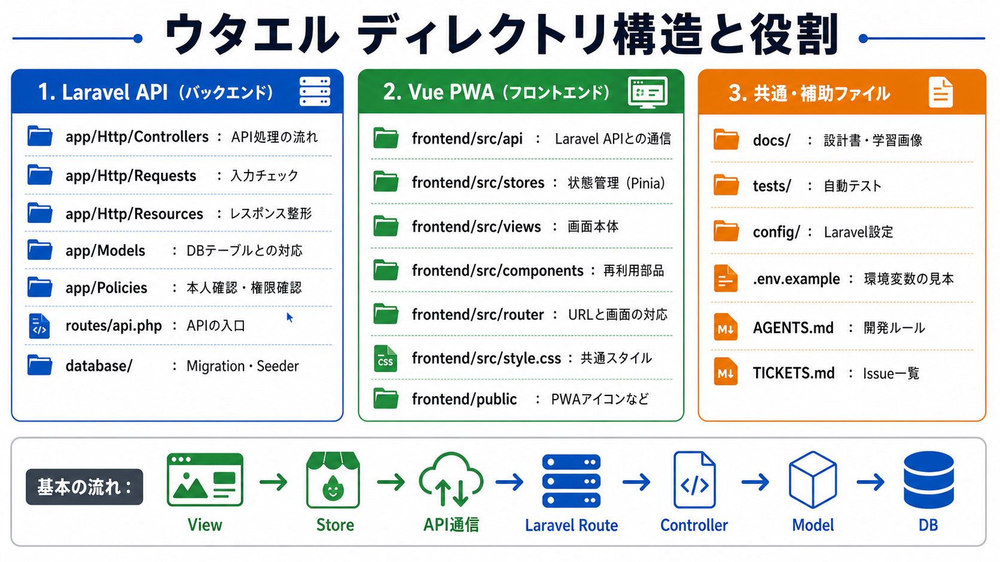

# ウタエル 開発振り返りレポート

**更新：** 2026年8月 / Issue #34完了時点

## 1. アプリ概要

ウタエルは、懐かしい曲や初めて歌う曲の曖昧な部分を、カラオケルーム内で音を出さずに確認できるリズム確認アプリである。

曲ごとのBPMをもとに、4拍子の視覚フィードバックを表示することで、歌い出しやテンポ感を思い出しやすくする。音を出せない場面でも、画面上のリズム表示を使って身体感覚でテンポを確認できることを目的としている。

## 2. 開発目的

この開発の目的は、完成品を作ることだけではなく、LaravelとVue.jsを使ったWebアプリケーションの全体構造を理解することである。

特に、Laravel側ではController、FormRequest、API Resource、Model、Policy、Serviceなどの責務分離を学び、Vue側ではComposition API、Pinia、Vue Router、Axiosを使ったSPA構成を学ぶことを重視した。

また、Issue単位で機能を分け、ブランチ作成、実装、整形、テスト、コミット、プッシュ、PR作成、マージまでの流れを経験することで、実務に近い開発プロセスを理解することも目的とした。

## 3. 技術構成

| 領域 | 技術 |
| --- | --- |
| バックエンド | Laravel 13 / PHP 8.3 |
| フロントエンド | Vue.js 3 / Vite |
| PWA | vite-plugin-pwa |
| DB | MySQL |
| 開発環境 | WSL2 / Docker Desktop / Laravel Sail |
| 認証 | Laravel Sanctum |
| 権限管理 | Spatie Permission |
| CSV出力 | Laravel Excel |
| API通信 | Axios |
| 状態管理 | Pinia |
| ルーティング | Vue Router |
| 外部API | iTunes Search API、Deezer、GetSongBPM、Spotify、YouTube Data API、設定可能な歌詞API |

## 4. 全体アーキテクチャ

ウタエルは、Laravel API + Vue.js PWA + MySQLで構成されたSPA型のWebアプリである。

```text
Vue.js 3 PWA
  ↓ Axios / JSON API
Laravel 13 API
  ↓ Eloquent
MySQL

Laravel API
  ├─ iTunes Search API（曲検索）
  ├─ Deezer / GetSongBPM / Spotify / YouTube（BPM補完）
  ├─ YouTube Data API（MV候補検索）
  └─ 歌詞Provider（既定：LRCLIB）
```

フロントエンドは、画面表示、ユーザー操作、状態管理、API呼び出しを担当する。バックエンドは、認証、認可、DB操作、外部Provider連携、CSV出力を担当する。DBにはMySQLを使用し、ユーザー、共通曲カタログ、お気に入り、タグ、プレイリストを管理する。



### Laravel側の責務

Laravel側はAPIサーバーとして、データ管理と業務ロジックを担当する。

具体的には、Sanctumによるログイン認証、Spatie Permissionによる`admin` / `user`の権限管理、曲カタログ・お気に入り・プレイリストCRUD、共有リンク、CSV出力、BPM・歌詞・MVの外部Provider連携を実装した。

また、Controllerに処理を集中させず、FormRequestでバリデーション、API Resourceでレスポンス整形、Policyで本人確認、Serviceで外部API連携を分ける構成にした。

### Vue側の責務

Vue側は、画面の表示とユーザー操作を担当する。

ログイン、お気に入り、曲検索、曲詳細、プレイリスト、共有プレイリスト、管理者画面を実装した。API通信は`src/api/`に分離し、ログイン状態、曲一覧、お気に入り、プレイリスト、リズム、YouTube MVの状態はPiniaで管理した。

これにより、画面コンポーネントは表示と操作に集中でき、API通信や状態管理の責務を分けられた。

## 5. Issue単位での開発プロセス

Issue #1〜#34では、機能を小さな単位に分けて段階的に実装した。#1〜#14で基礎機能を作り、#15以降でプレイリスト、外部曲検索、YouTube再生、歌詞、個人BPM、画面遷移を拡張した。

環境構築、DB設計、認証、権限管理、CRUD、外部API連携、CSV出力、フロントエンド画面、PWA、管理者画面という順番で進めたことで、アプリがどのように機能単位で積み上がっていくのかを理解できた。

| Issue | 内容 | 学習ポイント |
| --- | --- | --- |
| #1 | Laravel Sail環境構築 | Docker / Sail / Laravel初期構成 |
| #2 | DB設計・マイグレーション | Migration / Model / Relation |
| #3 | 認証API | Sanctum / Login / Register / Token |
| #4 | ロール設定 | Spatie Permission / admin・user |
| #5 | 公開曲マスタCRUD | Controller / FormRequest / Resource |
| #6 | Spotify API連携 | Service分離 / 外部API連携 |
| #7 | マイリストCRUD + タグ付け | Policy / Relation / 中間テーブル |
| #8 | CSV出力 | Laravel Excel / Exportクラス |
| #9 | Vue.js + PWA環境構築 | Vite / PWA / frontend構成 |
| #10 | ログイン画面・Axios設定 | Axios / Pinia / Router Guard |
| #11 | マイリスト画面 | Store / API module / View |
| #12 | リズム再生コンポーネント | Composition API / setInterval |
| #13 | 曲検索・追加画面 | 検索UI / マイリスト追加 |
| #14 | 管理者画面 | 曲マスタ管理 / admin向けUI |
| #15 | Playwright画面テスト | E2E / UX課題の発見 |
| #16 | プレイリスト・共有・音声再生 | リレーション / Policy / 公式プレイヤー |
| #17 | ユーザー向け曲検索・カタログ取り込み | Contract / Provider / 正規化 |
| #18 | お気に入り・プレイリストUX | 用語整理 / ダークテーマ / 再生導線 |
| #19 | プレイリスト導線・責務整理 | 一覧・詳細・管理の責務分離 |
| #20 | YouTube MV再生 | 公式iframe / 埋め込み制約 |
| #21〜#24 | BPM・連続再生・歌詞・YouTube検索の安定化 | フォールバック / 候補照合 / 障害復帰 |
| #25〜#31 | 曲詳細・検索・お気に入り・プレイリストUX | ドラッグ操作 / 状態同期 / 歌いだし表示 |
| #32〜#34 | 再生状態・MV/BPM連動・画面遷移 | Pinia共有状態 / ミニプレーヤー / スライド遷移 |

各Issueでは、以下の流れを繰り返した。

```text
全体要件と実装手順の把握
↓
作業ブランチの作成
↓
必要なファイルの作成
↓
MVCや関連クラスの実装
↓
Pintによる整形
↓
機能テスト・画面確認
↓
コミット
↓
プッシュ
↓
PR作成
↓
マージ
```

今回の開発前は、アプリ開発が「1つの大きなコードを書く作業」のように見えていた。しかし実際には、Controller、Model、Request、Resource、Service、Policy、Vue Component、Store、API moduleなど、責務ごとにファイルを分け、それらを少しずつ接続していく作業だと理解できた。

この経験により、MVC構成や責務分離の考え方だけでなく、Issue単位で開発を進める実務的な流れも学ぶことができた。

## 6. 代表機能の処理フロー

代表機能として、曲のテンポ（BPM）を表示し、リズムを確認する処理を整理する。

```text
管理者が曲を登録、またはユーザーがiTunes検索結果から曲を取り込む
↓
Laravel APIがバリデーションと重複確認を実行
↓
曲カタログ（songs）に保存
↓
必要に応じてBpmResolverがDeezer → GetSongBPM → Spotify → YouTubeの順に補完
↓
ユーザーが検索・お気に入り・プレイリストから曲詳細を開く
↓
Vueが曲詳細APIを呼び出し、BPM・歌詞・MV操作を表示
↓
ユーザーがリズム確認またはYouTube MV再生を開始
↓
60000 / BPMで1拍あたりの間隔を計算
↓
4拍子の視覚フィードバックを表示。MV再生時はMV候補のBPMと状態を連動
```

リズム再生では、BPMが「1分間の拍数」であることを利用し、`60000 / BPM`で1拍あたりのミリ秒を計算している。たとえば120BPMであれば、1拍は500msになる。

`rhythmPlayback`ストアが`setInterval`と`clearInterval`を一元管理し、1拍目を強拍、2〜4拍目を弱拍として表示する。停止、ログアウト、MV終了時にタイマーを解除するため、画面遷移後に古いリズムが動き続けない。

外部BPMは複数Providerのフォールバックで取得し、取得できない場合も曲を保存できる。ユーザーは曲詳細のタップテンポで個人BPMを登録でき、曲マスタのBPMを変更せずに自分の練習値を持てる。

## 7. 学んだこと

今回の開発では、サーバー側と画面側で責務を分ける重要性を学んだ。

Laravelは認証、認可、DB操作、APIレスポンス整形に向いており、Vueは画面表示やユーザー操作の表現に向いている。それぞれの役割を分けることで、効率的に開発できることを理解した。

主に学んだことは以下である。

- Laravel Sail + Dockerによる開発環境構築
- Migration / Model / RelationによるDB設計
- SanctumによるAPI認証
- Spatie Permissionによるロール管理
- Policyによる本人確認
- FormRequestによるバリデーション分離
- API Resourceによるレスポンス整形
- Serviceクラスによる外部API処理の分離
- Contract / Providerによる外部サービスの差し替え境界
- Laravel ExcelによるCSV出力
- Vue Routerによる画面遷移
- Piniaによる状態管理
- AxiosによるAPI通信
- PWA構成の基本
- `setInterval`と`clearInterval`を使ったリズム再生のライフサイクル管理
- PiniaでMV iframeとBPMリズムの状態を画面遷移後も保持する設計
- YouTube公式プレイヤーの制約を守りながら候補切り替えと障害復帰を実装する考え方
- 画像出力を使って構造を視覚的に理解する開発プロセス
- CRUDを機能単位で実装・確認する流れ

特に、機能単位でCRUDや画面確認を行いながら開発を進める流れは大きな学びだった。一気に全体を作るのではなく、小さなIssueに分けて、1つずつ動作確認しながら積み上げることで、完成までの道筋を具体的に把握できた。

## 8. 苦戦したこと

外部サービスは、曲検索、BPM、歌詞、MVでそれぞれ利用条件・レスポンス・障害パターンが異なる。特定のProviderを必須にすると曲追加全体が止まるため、検索・BPM・歌詞・MVを別の境界に分け、取得できない場合もローカル機能を継続できる構成へ整理した。

また、全体アーキテクチャの理解を目的に開発を進めた一方で、各処理の細かいコードの流れまでは十分に追いきれなかった部分もある。特に、画面からAPIへリクエストが送られ、Controller、Request、Model、Resourceを通ってレスポンスが返るまでの流れは、今後さらに復習したい。

## 9. 今後の改善

今後、外部APIを使う場合は、実装前に以下を確認する必要がある。

- 現在も利用可能なAPIか
- 無料プランで利用できるか
- 商用・個人開発で使えるか
- 認証方式やAPI制限は問題ないか
- 代替APIや手入力運用が必要か

また、実装前にディレクトリ構成と画面遷移をより丁寧に整理しておけば、各ファイルの役割をさらに理解しやすかったと感じた。Laravelでは、`app/Http/Controllers`、`app/Http/Requests`、`app/Http/Resources`、`app/Models`、`app/Policies`、`app/Services`など、配置場所ごとに責務が分かれている。Vueでは、View、Component、API module、Storeを分けることで、MVやリズムのような画面をまたぐ状態も追いやすくなる。

今後は、実装前に「どの処理をどのディレクトリ・どのクラスに置くのか」を先に整理してから進めたい。

さらに、動作させることを優先したため、なぜそのファイルに処理を書くのか、なぜその責務に分けるのかを後から理解する場面が多かった。今後は、実装前に処理フロー図や簡単なメモを作り、コードを書く前に全体の流れを確認する習慣をつけたい。

## 10. まとめ

Issue #34までの開発を通して、Laravel APIとVue.js PWAを組み合わせたSPA型アプリの全体像を学ぶことができた。

特に、バックエンドとフロントエンドの責務分離、APIを中心としたデータの流れ、認証・認可・CRUD・外部APIフォールバック・画面遷移を、Issue単位の実装を通じて理解できたことが大きな成果である。

一方で、コードの細かい流れや外部API調査には改善点も残った。今後は、処理フローを自分の言葉で説明できるように復習し、実装前の設計整理をより丁寧に行いたい。
